# Globula — AI Dev Agent: Diagrams

---

## 1. Architecture Overview

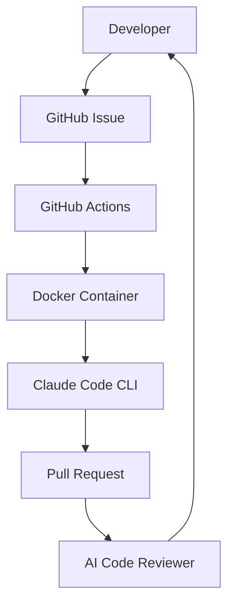

---

## 2. Full Task Cycle

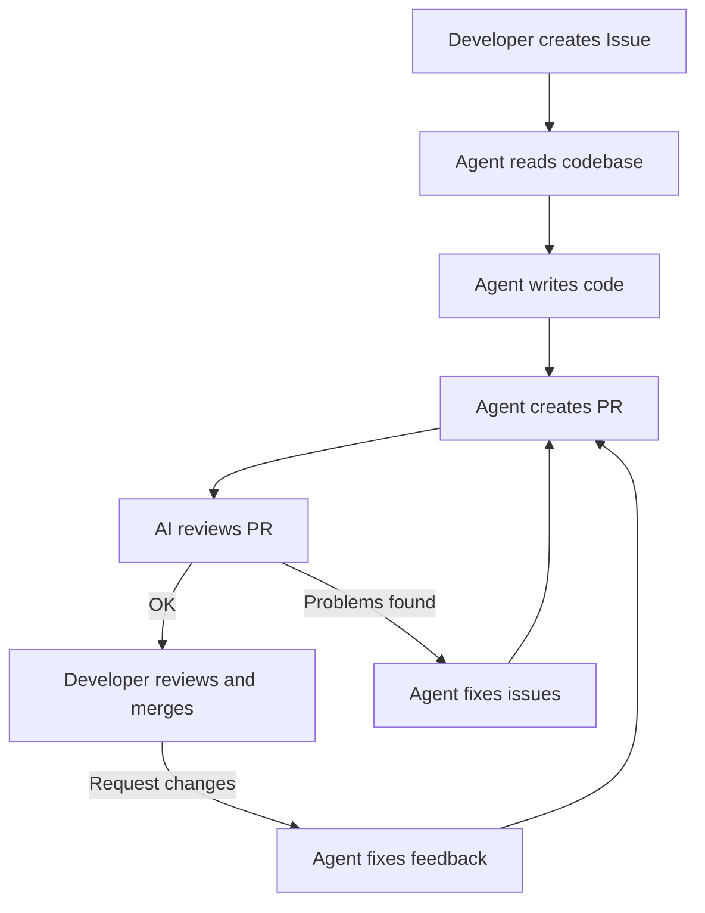

---

## 3. Inside the Container

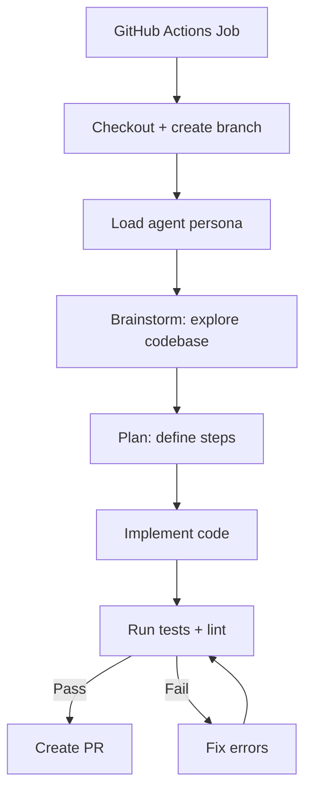

---

## 4. Three Workflows

### 4a. task-execute.yml

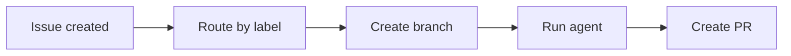

### 4b. pr-review.yml

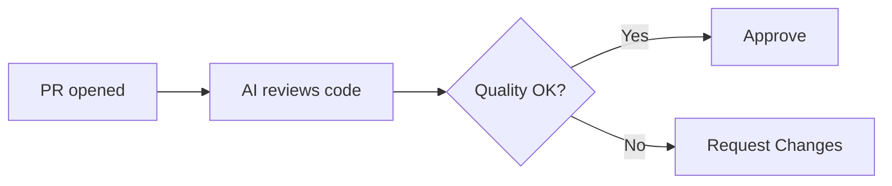

### 4c. pr-fix.yml

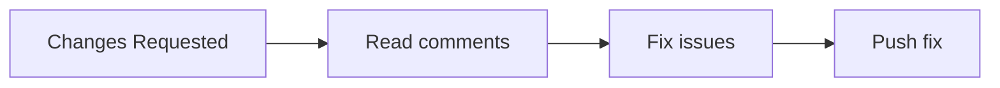

### How workflows connect

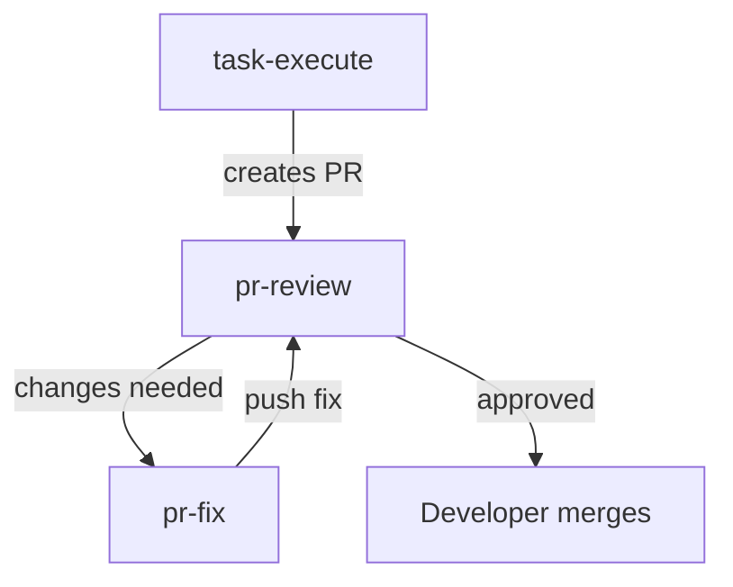

---

## 5. Agent Persona

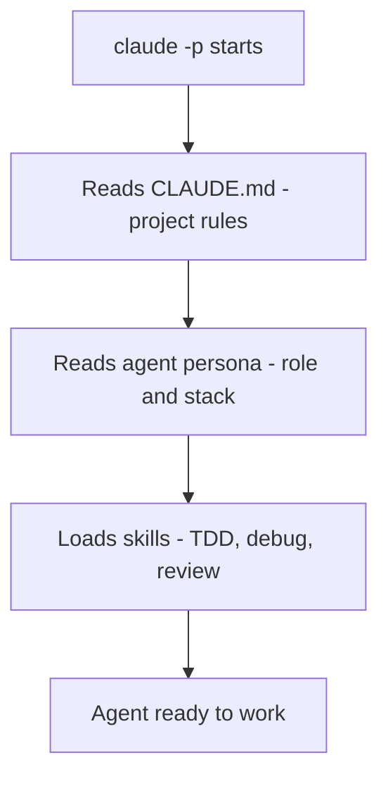

---

## 6. Three Options

### Option A: Basic

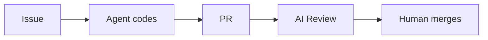

### Option B: With auto-fix

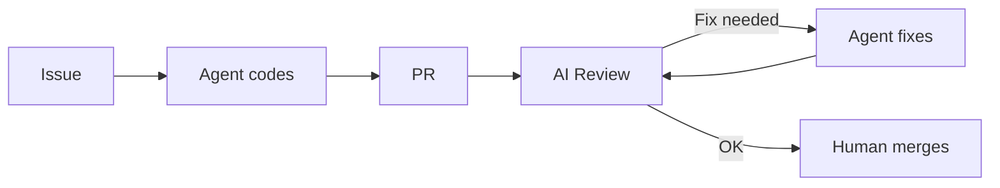

### Option C: Multi-agent

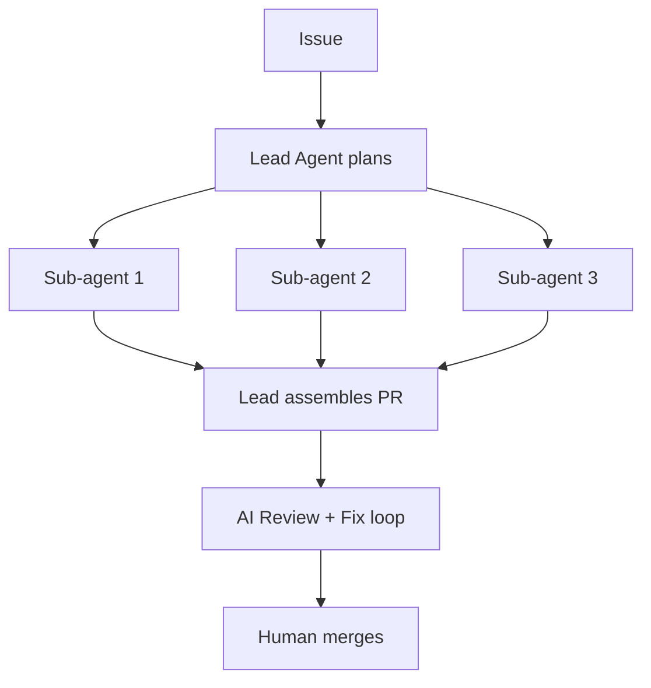

---

## 7. Security

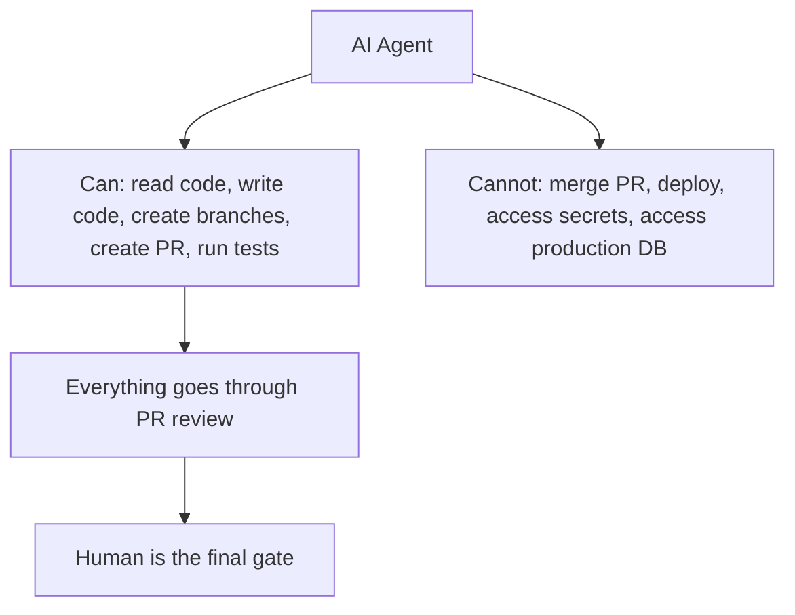
