# Globula — MLM CRM: Diagrams

---

## 1. Architecture Overview

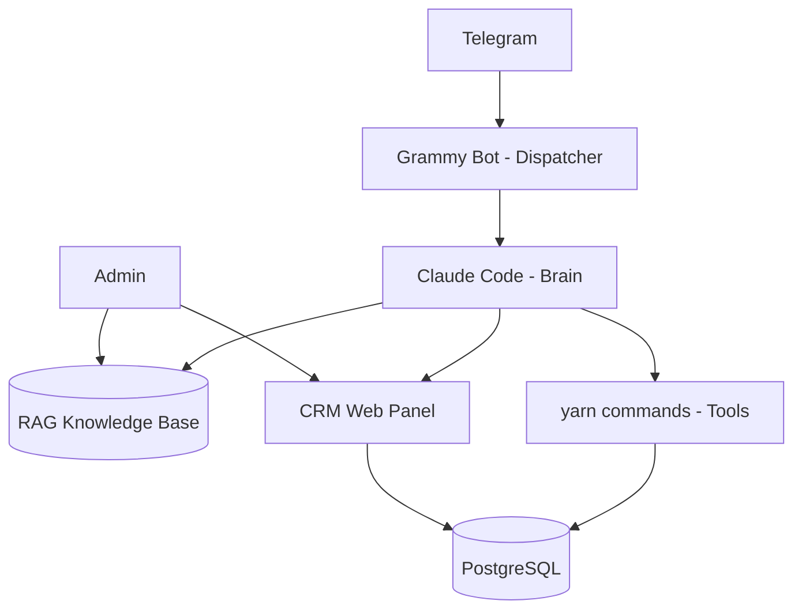

---

## 2. Three Agents

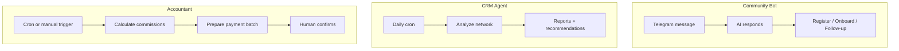

---

## 3. Registration Flow

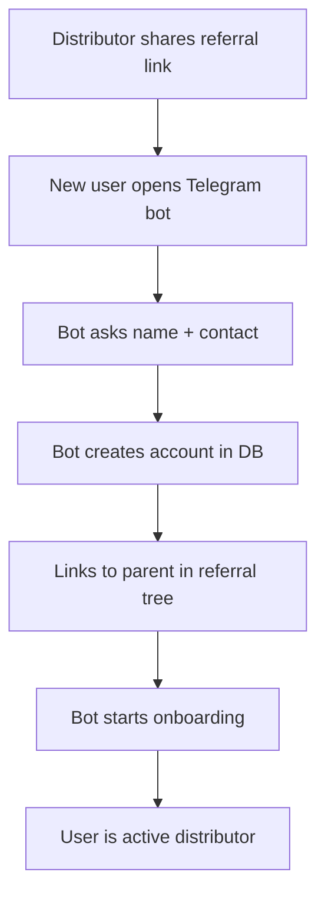

---

## 4. Lead Funnel

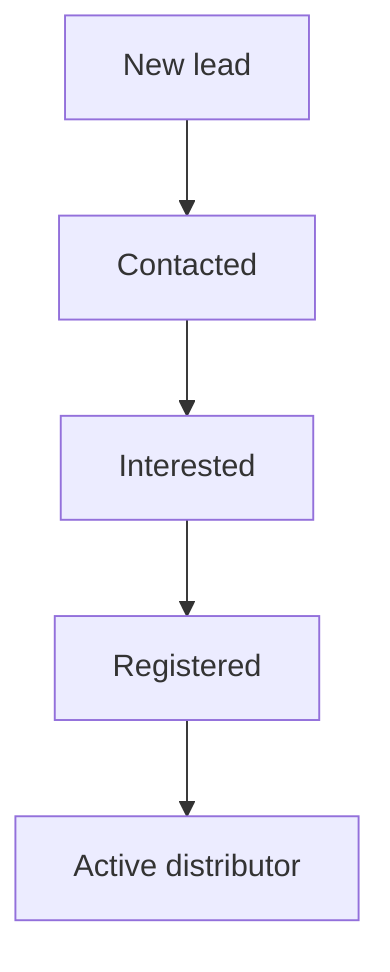

---

## 5. Commission Calculation

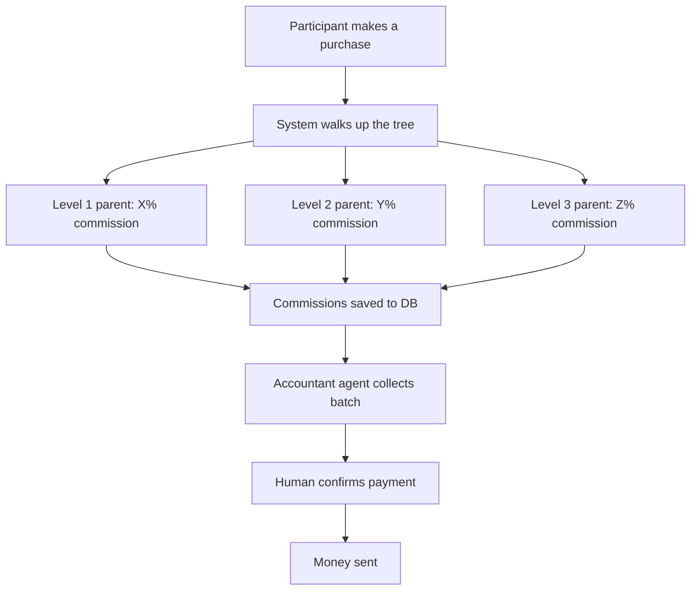

---

## 6. Payment Security - Multisig

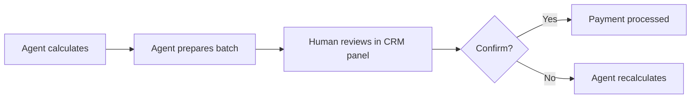

---

## 7. Telegram Bot - Two Modes

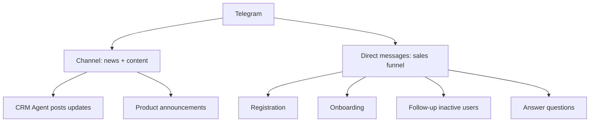

---

## 8. RAG Knowledge Base

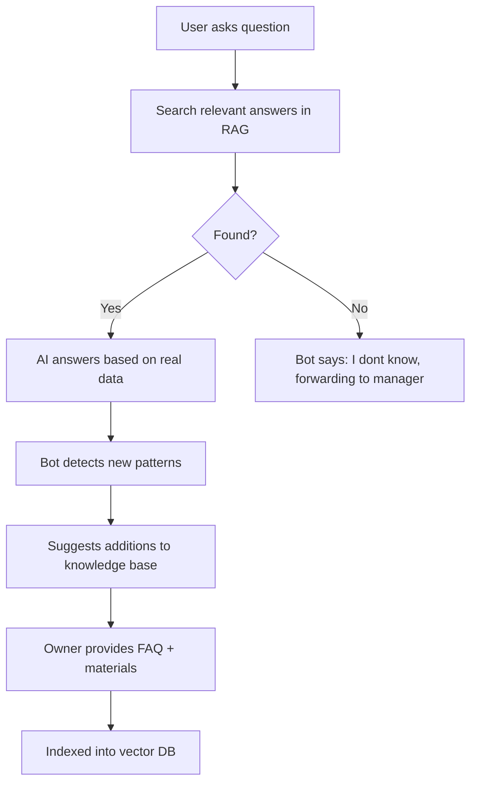

---

## 9. Agent-First Pattern

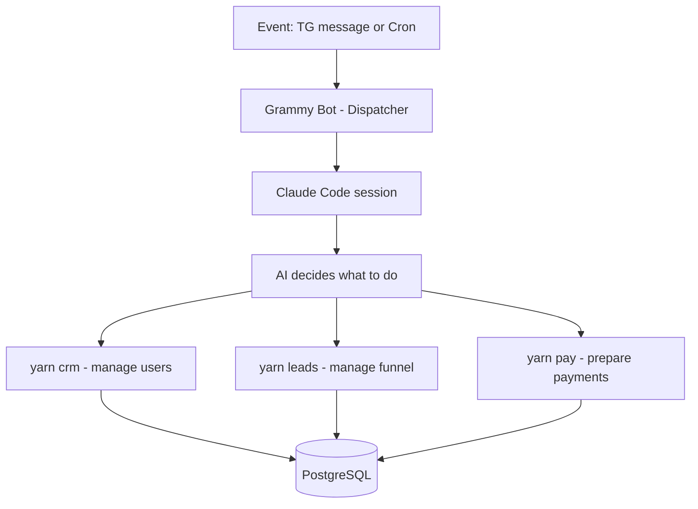

---

## 9. Three Options

### Option A: MVP

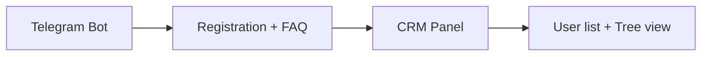

### Option B: With AI automation

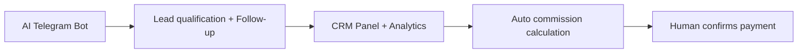

### Option C: Full system

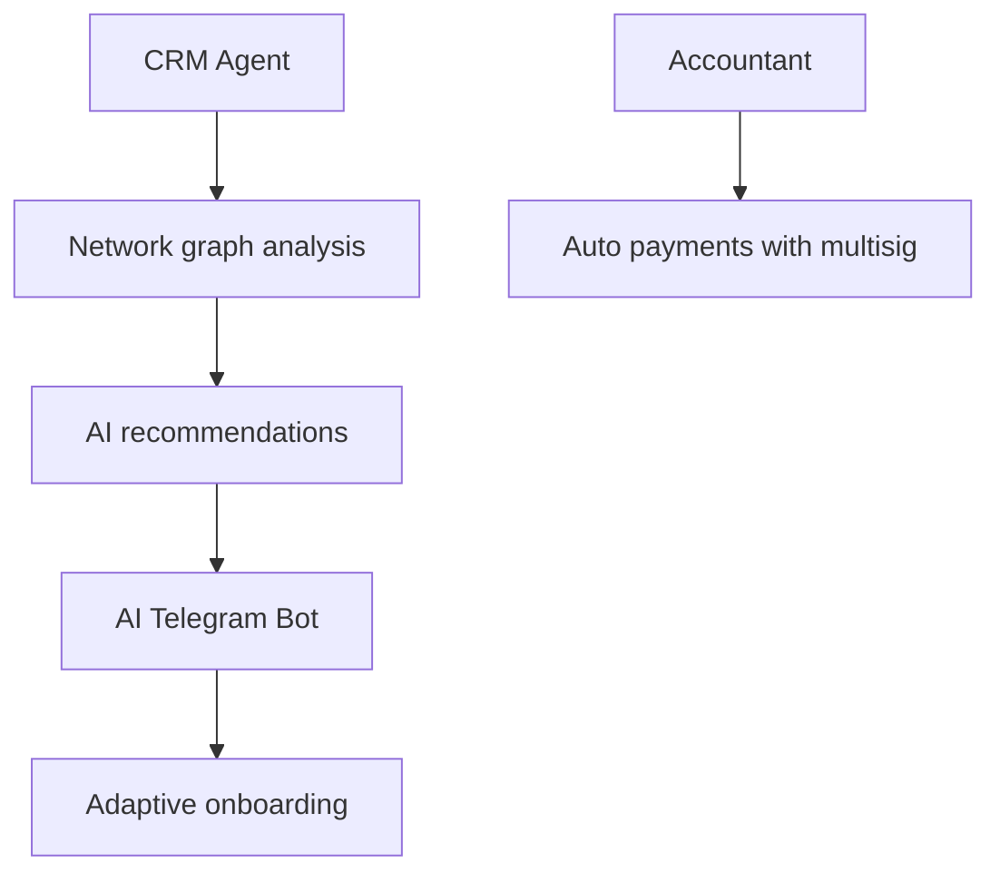
