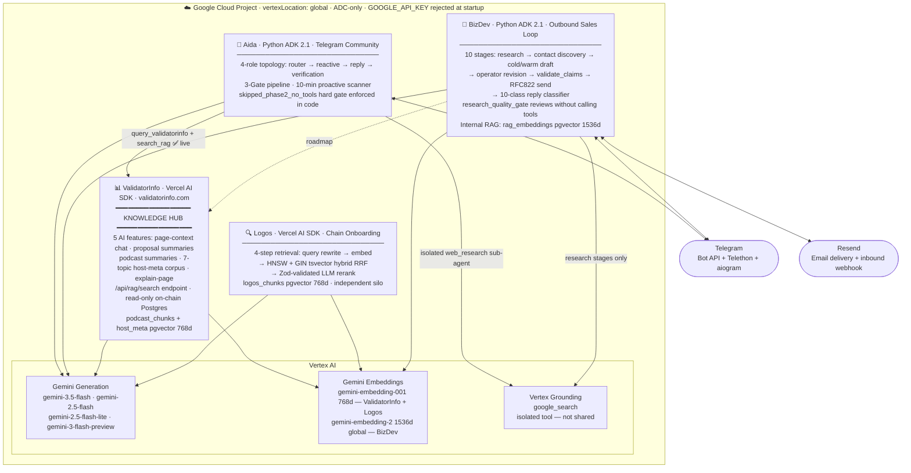

# CitizenWeb3 AI Operations Platform — Architecture

> Four production agents on one Google Cloud project, one Vertex AI backbone.  
> Operating principle: **the model proposes → the pipeline verifies → the operator approves.**

---

---

## Surfaces at a glance

| Surface | Runtime | Key mechanism |
|---|---|---|
| **Aida** | Python ADK 2.1 · 4 roles | `len(tool_calls2) == 0 → skipped_phase2_no_tools` hard gate |
| **BizDev** | Python ADK 2.1 · 10 stages | `research_quality_gate` reviews without searching; `validate_claims` maps claims to `factId` |
| **ValidatorInfo** | Vercel AI SDK + `@ai-sdk/google-vertex 4.0.128` | Knowledge hub: `/api/rag/search` + read-only on-chain Postgres grounding Aida today, BizDev on roadmap |
| **Logos** | Vercel AI SDK + `@ai-sdk/google-vertex 4.0.128` | HNSW + GIN tsvector hybrid search via RRF + Zod-validated LLM rerank |

## Model registry

| Model | Where used |
|---|---|
| `gemini-2.5-flash-lite` | Aida router |
| `gemini-3.5-flash` | Aida reactive/reply/verification · BizDev all stages · ValidatorInfo chat |
| `gemini-2.5-flash` | Logos query rewrite + LLM rerank |
| `gemini-3-flash-preview` | Logos answer generation |
| `gemini-embedding-001` 768d | ValidatorInfo + Logos vector stores |
| `gemini-embedding-2` 1536d global | BizDev internal RAG (asymmetric task types) |

## Repositories

- [`citizenweb3/ai-integrations`](https://github.com/citizenweb3/ai-integrations) — branches: [`telegram-growth-agent-vertex`](https://github.com/citizenweb3/ai-integrations/tree/telegram-growth-agent-vertex) (Aida) · [`bizdev-email-agent`](https://github.com/citizenweb3/ai-integrations/tree/bizdev-email-agent) (BizDev) · [`logos-onboarding-assistant`](https://github.com/citizenweb3/ai-integrations/tree/logos-onboarding-assistant) (Logos)
- [`citizenweb3/validatorinfo`](https://github.com/citizenweb3/validatorinfo) — ValidatorInfo
